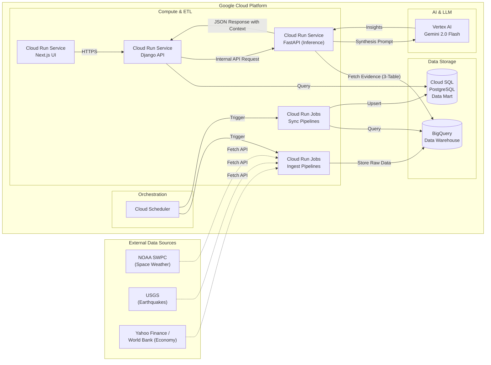
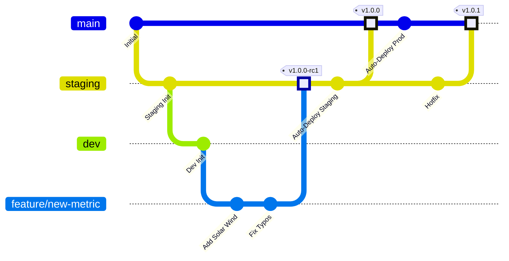

# Celestial Biome

**Celestial Biome is a platform designed to discover "Singularities"—qualitative turning points and unseen insights—by integrating diverse measurable data.**

Celestial Biome は、さまざまな計測可能なデータを蓄積・統合し、そこから**「特異点（質的な転換点）」**を見つけ出すプラットフォームプロジェクトです。（開発中）

一見無関係に見える以下の要素を横断的に可視化し、複雑系の中に潜む相関関係を明らかにすることで、人生やプロジェクトにおける意思決定の新たな羅針盤を構築しています。

* **Sensory:** Coffee, Wine, Fly Fishing (五感・感性)
* **Environment:** Space, Outdoor, Geology (自然環境・宇宙)
* **Society:** Economy, Market Indicators (社会・経済活動)

By visualizing the synthesis of elements that influence human life—ranging from **coffee, wine, and fly fishing** to **space weather and economic activities**—I aim to uncover hidden connections and provide new metrics for decision-making.


Google Cloud Platform (GCP) 上に構築され、最新の技術スタックと厳格な運用ルールに基づき開発しています。

## 🌌 Structured RAG for Multi-Domain Correlation

本プロジェクトの核心は、単なる LLM チャットではなく、「構造化 RAG (Structured RAG)」 を用いた多角的な相関分析にあります。

1. 概念：なぜ "Structured" なのか？

    一般的な RAG は「非構造化テキスト」をベクトル検索しますが、本システムは BigQuery 上の「構造化数値データ」 を直接参照します。

    - 精度 (Precision): ベクトル検索のような「曖昧な近さ」ではなく、SQL による「厳密な数値」をコンテキストとして注入するため、ハルシネーション（嘘）を極限まで抑制します。

    - 最新性 (Freshness): ETL パイプラインによって常に更新される最新の観測データを、デプロイなしで即座に推論に反映します。

2. 多領域相関 (Multi-Domain Correlation)

    一見無関係に見える 3 つのドメインを、LLM の高度な推論能力を用いて結合します。

    |ドメイン|ソースデータ|役割|
    | ------------------- | --------------------- | ----------- |
    |Space|太陽風, Kp 指数, 電離圏状況|地球環境へのポテンシャルな影響の特定|
    |Earth|地震の規模 (M), 震源の深さ, 発生場所|地質学的な活動状態の把握|
    |Society|株価指数, 為替, 主要経済指標|人間の社会・経済活動の心理的バイアス|

3. 特異点の抽出 (Singularity Detection)

    これら 3 層のデータを Gemini 2.0 のコンテキスト窓に統合し、「データ間の非自明な相関関係」 や 「質的な転換点（特異点）」 を言語化します。

    例えば・・・ 「強い地磁気嵐が発生している最中に、特定の地域で群発地震が発生し、同時に市場のボラティリティが高まっている」といった状況を、客観的エビデンス（Evidence Chips）と共に提示します。

## 🌍 Production Environment

本プロジェクトは、開発の安全性と品質を担保するため、**Staging** と **Production** の完全分離構成を採用しています。

### Production (Stable)

- **Frontend (App):** https://app.celestial-biome.com
- **Backend (API):** https://api.celestial-biome.com

### Staging (Integration / QA)

- **Frontend (App):** https://app-staging.celestial-biome.com
- **Backend (API):** https://api-staging.celestial-biome.com

## 💎 Key Features: Celestial Insights
一見無関係に見えるデータ群から、Vertex AI (Gemini 2.0) を用いて「特異点」を抽出する相関推論機能を実装しました。


⚠️※要改善が必要

これらの機能は **celestial-inference** リポジトリで実装しており API で本リポジトリと連携しいる

### 🌌 相関推論チャット (CelestialChat)
宇宙天気・地震活動・世界経済の最新データを背景知識として持つ AI アドバイザー。
* **Evidence-Based Response**: BigQuery から抽出された 24 時間以内の実数値を「証拠」としてプロンプトに注入。
* **Integrated UI**: 推論に使用された具体的なデータ（Kp指数、地震規模、経済指標）を、独自のアイコンチップとして可視化。
* **Secure Connection**: Backend 経由で推論エンジン (FastAPI) と通信し、Firebase Auth によるアクセス制御を完備。

### 🛠 推論スタック
* **Model**: Gemini 2.0 Flash (Vertex AI)
* **Engine**: FastAPI (celestial-inference)
* **Data Bridge**: Google BigQuery (3-table synthesis)
* **Custom Domains**:
    - Production: `inference.celestial-biome.com`
    - Staging: `inference-staging.celestial-biome.com`

## 🏗 Architecture & Tech Stack

本プロジェクトは以下の技術スタックとバージョンを厳守して開発されています。

### Backend (Server Side)

| Component           | Technology            | Version     | Note                     |
| ------------------- | --------------------- | ----------- | ------------------------ |
| **Framework**       | Django                | 5.2 LTS | App Config / ORM         |
| **API**             | Django REST Framework | Latest      | API Construction         |
| **Schema**          | drf-spectacular       | Latest      | Swagger UI / OpenAPI 3 |
| **Language**        | Python                | 3.12**    |                          |
| **Pkg Manager**     | uv                | Latest      | pip/poetry 使用禁止  |
| **Lint/Fmt**        | Ruff                  | Latest      | Enforced by pre-commit   |
| **Type Check** 　　　| Ty 　　　　　　　　　| Latest      | Static Type Checker |
| **Testing**         | pytest                | Latest      |                          |
| **Monitoring**      | Sentry SDK (Django)   | ~2.0.0      | Runtime Error & Performance Tracking |
| **Async**           | Cloud Tasks       | -           | No Celery/Redis          |
| **Data Analysis**　 | Pandas            | Latest      | Data manipulation        |

### Frontend (Client Side)

| Component         | Technology         | Version     | Note                         |
| ----------------- | ------------------ | ----------- | ---------------------------- |
| **Framework**     | Next.js            | 16      | App Router                   |
| **Language**      | TypeScript         | 5.x         |                              |
| **Runtime**       | Node.js            | v22 LTS |                              |
| **Styling**       | Tailwind CSS       | v4      |                              |
| **Lint/Fmt**      | Biome          | Latest      | ESLint/Prettier 使用禁止 |
| **Type Gen**      | openapi-typescript | Latest      | Schema Driven Dev            |
| **Testing**       | Vitest             | Latest      | Unit & Component Testing     |
| **Visualization** | Echarts            | 6.x         | Charts & Graphs              |

### Infrastructure

| Component          | Technology          | Note                                     |
| ------------------ | ------------------- | ---------------------------------------- |
| **Domain**         | Custom Domain      | Terraform & Cloud Run Mapping            |
| **Cloud**          | Google Cloud (GCP)  |                                          |
| **Compute**        | Cloud Run           | Frontend & Backend (Standalone)          |
| **ETL / Batch**    | Cloud Run Jobs      | Scheduled by Cloud Scheduler             |
| **Database**       | Cloud SQL           | PostgreSQL 16 (App Data & Data Mart**) |
| **Data Warehouse** | BigQuery            | Time-series data storage**             |
| **Storage**        | Cloud Storage (GCS) | Static & Media files                     |
| **IaC**            | Terraform + HCP Terraform Cloud | Infrastructure management; state managed by Terraform Cloud (VCS-Driven) |
| **CI/CD**          | GitHub Actions      | CI, Build, Deploy                        |
| **Monitoring**     | Sentry              | Error Tracking, Source Maps (Frontend)   |
| **Authentication** | **Firebase Authentication** | Identity Provider (Google Login), Secure Session Management, Staging/Prod Isolation |

---

## 📂 Project Structure

```text
celestial_biome
├── .github/workflows       # CI/CD (ci.yml, deploy.yml, frontend-test.yml, backend-test.yml)
├── .pre-commit-config.yaml # Code Quality Rules (Ruff & Biome)
├── compose.yaml            # Local Development (Hot Reload)
├── src
│   ├── backend             # Django Root
│   │   ├── config          # Settings, URLs
│   │   ├── pyproject.toml  # Managed by uv
│   │   └── Dockerfile      # Prod: uv base
│   └── frontend            # Next.js Root
│       ├── app             # App Router
│       │   └── components  # UI Components(Feature-based folders)
│       ├── vitest.config.ts # Vitest Config
│       ├── biome.json      # Biome Config
│       └── Dockerfile      # Prod: Node 22 Multi-stage
└── terraform               # Infrastructure definitions
```

## 💻 Local Development

### Prerequisites:

- Docker & Docker Compose

- uv (Python Package Manager)

- Node.js v22+ & npm

1. Setup Backend
   Backend の依存関係は `uv` で管理されています。

```text
cd src/backend
uv sync
```

2. Setup Frontend
   Frontend の依存関係をインストールします。

```text
cd src/frontend
npm install
```

3. Start Application
   Docker Compose を使用して開発環境（Hot Reload 有効）を起動します。

```text
# プロジェクトルートで実行

docker compose up --build
```

- Frontend: http://localhost:3000

- Backend API: http://localhost:8000

- Admin Panel: http://localhost:8000/admin/

## ⚙️ Operational Rules & Workflows

### 1. Schema Driven Development

Backend と Frontend の型同期は、OpenAPI スキーマを介して行います。

1.  Backend: モデルや API に変更を加える。
2.  Backend: `drf-spectacular` 経由で `schema.yml` (OpenAPI) を生成する。
3.  Frontend: `openapi-typescript` を実行し、Backend の型定義を TypeScript 型として自動生成・取り込みを行う。

### 2. Code Quality (Linting & Type Checking)

コミット時および CI 実行時に、以下のツールによる品質チェックが強制されます。

- Backend:
  - `Ruff`: Lint と Format (pre-commit で強制)
  - `Ty`: 静的型チェック (CI で強制)

- Frontend:
  - `Biome`: Lint と Format (pre-commit で強制)

手動実行する場合：

```text
# Backend (src/backend)

uv run ruff check --fix .  # Lint修正
uv run ruff format .       # Format修正
uv run ty check            # 型チェック実行

# Frontend (src/frontend)

npx biome check --write .
```

### 3. Testing

Backend, Frontend 共に単体テスト環境が整備されています。
開発時はこまめにテストを実行し、品質を担保してください。

- **Backend (pytest)**:
  ```bash
  # src/backend で実行
  uv run pytest
  ```
  - `test_models.py`: DB モデルの CRUD テスト
  - `test_commands.py`: 管理コマンド（Ingest, Sync）のロジックテスト
  - `test_ingest.py`: 外部 API 連携（NOAA）のモックテスト
  - `test_views.py`: API エンドポイントのレスポンス形式テスト
- **Frontend (Vitest)**:
  ```bash
  # src/frontend で実行
  npm test
  ```
  - `utils.test.ts`: ロジック関数の単体テスト
  - `chart-options.test.ts`: グラフ設定（ECharts）のスナップショットテスト
  - `ui-parts.test.tsx`: UI コンポーネントの描画テスト
  - `useSpaceWeather.test.ts`: カスタムフックとデータ取得フローのテスト

### 4. Async Operations

非同期処理が必要な場合は、Celery/Redis 構成ではなく、**Google Cloud Tasks** を使用してください。

### 5. Data Pipeline

データを収集・蓄積し、可視化するパイプラインを構築しています。
**Data Warehouse (BigQuery)** と **Data Mart (Cloud SQL)** を分離することで、分析用データの蓄積と Web アプリの高速応答を両立させています。


**参考（NOAA Space Weather）**
1.  **Ingestion (ETL)**: Cloud Run Job (`ingest_space_weather`) が NOAA からデータを取得し、**BigQuery** に蓄積 (毎時 0 分実行)。
2.  **Sync (Data Mart)**: Cloud Run Job (`sync_bq_to_db`) が BigQuery から直近 7 日分のデータを集計・取得し、**Cloud SQL** の専用テーブルに洗い替え (毎時 5 分実行)。
    - **Transaction**: データの不整合を防ぐため、`transaction.atomic` を用いて全削除・一括挿入（Bulk Create）を安全に行います。
3.  **Serving**: Backend API は **Cloud SQL** を参照してデータを返却。これにより、BigQuery の起動オーバーヘッドを回避し、高速なレスポンスを実現。
    - **Optimization**: 取得したデータに対し、Pandas を用いて Pivot 変換（Long -> Wide）や欠損値の補完（Forward Fill）を行い、Frontend が描画しやすい形式でレスポンスします。
4.  **Visualization**: Frontend (Next.js + Echarts) でデータを可視化。

### 6. Automated Code Review (CodeRabbit)

本プロジェクトでは、[CodeRabbit](https://coderabbit.ai) による AI コードレビューを導入しています。

#### 概要

`main` および `staging` ブランチへの Pull Request が作成・更新されると、CodeRabbit が自動でコードレビューを実施し、日本語でフィードバックを投稿します。

#### 主な機能

- **ウォークスルーサマリー**: PR 全体の変更内容を自動で要約
- **ファイルごとのレビュー**: 各ファイルの変更に対してインラインコメントを投稿
- **パス別カスタム指示**: バックエンド・フロントエンド・インフラそれぞれに適したレビュー観点を設定済み

  | パス | レビュー観点 |
  | ---- | ----------- |
  | `src/backend/**` | Django/DRF パターン、uv、Ruff/Ty、Firebase 認証 |
  | `src/frontend/**` | Next.js App Router、Server/Client Component、Biome |
  | `src/backend/**/migrations/**` | 自動生成ファイルのためレビュー対象外 |
  | `**/*.tf` | Google Cloud リソース定義の妥当性 |
  | `.github/workflows/**` | CI/CD パイプラインの安全性と正確性 |

#### 設定ファイル

レビューの挙動は `.coderabbit.yaml` で管理されています。

```yaml
# .coderabbit.yaml（抜粋）
language: "ja"
reviews:
  profile: "chill"
  auto_review:
    enabled: true
    base_branches:
      - "main"
      - "staging"
```

#### CodeRabbit へのフィードバック

PR のコメント欄で `@coderabbitai` に話しかけることで、追加の質問や再レビューの依頼が可能です。

```text
@coderabbitai このファイルの変更をもう一度詳しくレビューしてください。
```

## 📚 API Documentation (Swagger UI)

drf-spectacular により、OpenAPI 仕様書とインタラクティブなドキュメントが自動生成されます。 ローカル環境起動中、以下のURLからアクセス可能です。

- Swagger UI: http://localhost:8000/api/schema/swagger-ui/
  - APIの仕様確認、パラメータ (`start_date`, `end_date`, `country`) のテスト実行が可能です。
- Redoc: http://localhost:8000/api/schema/redoc/
- Schema (YAML): http://localhost:8000/api/schema/

## 📡 Data Sources

本プラットフォームでは、以下の信頼性の高い外部データソースから定期的にデータを収集・統合しています。

### 1. Space Weather (宇宙天気)
- **Source:** [NOAA Space Weather Prediction Center (SWPC)](https://www.swpc.noaa.gov/)
- **Description:** 太陽活動と地球周辺の宇宙環境データ。
  - **GOES Satellite:** 太陽フレア監視のためのX線フラックス (Primary Satellite)。
  - **Solar Wind:** 太陽風の速度 (Plasma) および 惑星間磁場 (Magnetometer / Bz)。
  - **Kp Index:** 地磁気嵐の大きさを表す指数。

### 2. Geology (地質・地震)
- **Source:** [USGS Earthquake Hazards Program](https://earthquake.usgs.gov/)
- **Description:** USGS Real-time Notifications, Feeds, and Web Services を使用し、世界中で発生した地震データを取得。
  - **Metrics:** 発生時刻、マグニチュード (M2.5以上)、震源地 (緯度・経度・深さ)。

### 3. World Economy (世界経済)
- **Source:** Yahoo Finance & The World Bank
- **Description:** 市場心理と経済のファンダメンタルズを可視化するための指標。
  - **Yahoo Finance:** 主要国の株価指数 (S&P 500, Nikkei 225, FTSE 100, etc.) を `yfinance` 経由で取得。
  - **World Bank Open Data:** 各国のGDPやインフレ率などのマクロ経済指標を `wbgapi` 経由で取得。

## 🛠 Management Commands

- **Ingest Space Weather Data**
  NOAA から宇宙天気データを手動で取得・保存します。

  ```bash
  # ローカル実行 (.env に GCP_PROJECT_ID が必要)
  uv run python manage.py ingest_space_weather --days 7
  ```

- Sync Data Mart (BigQuery -> Cloud SQL)
  BigQuery から直近 7 日間のデータを取得し、Cloud SQL (Data Mart) を更新します。
  ```bash
  uv run python manage.py sync_bq_to_db
  ```

### Data Safety & Governance
- Deletion Protection:
  BigQuery の Raw データテーブル (Earthquake, Economy 等) は Terraform により deletion_protection = true が設定されており、オペレーションミスによる偶発的なデータ削除を防止しています。

- Secret Management:
  データベースの認証情報は Secret Manager で厳重に管理され、リポジトリ内に機密情報は一切含まれていません。

## 🚀 Deployment & Operations

### Deployment

GitHub Actions によるアプリデプロイと、**HCP Terraform Cloud (VCS-Driven)** によるインフラ管理を組み合わせた、Git-Flow ベースの CI/CD パイプラインを構築しています。

### Terraform Cloud

インフラ（Cloud Run / Cloud SQL / BigQuery 等）は [HCP Terraform Cloud](https://app.terraform.io) の VCS-Driven Workflow で管理しています。

| Workspace | Branch | 動作 |
|---|---|---|
| `celestial-biome-prod` | `main` | PR 時に speculative plan、マージ後に手動 apply |
| `celestial-biome-staging` | `staging` | PR 時に speculative plan、マージ後に手動 apply |

### Deployment Workflow



   ### グラフの解説

このグラフは以下の開発サイクルを表しています：

1.  **Feature Development**: `feature` ブランチ等で開発を行います。
2.  **Staging Deployment**:
`staging` ブランチへマージ（またはプッシュ）すると、GitHub Actions が **Staging 環境** へデプロイを実行します。ここで動作確認を行います。
    - Trigger: `staging` ブランチへの Push
    - Action: Staging 環境 (Cloud Run / DB / Job) へデプロイ
    - Purpose: 統合テスト、UI/UX確認、データ移行の事前検証
3.  **Production Deployment**:
Staging での検証が完了した後、`main` ブランチへマージすると、GitHub Actions が **Production 環境** へデプロイを実行します。
    - Trigger: `main` ブランチへの Push (Staging での検証完了後)
    - Action: Production 環境へデプロイ
    - Purpose: 本番リリース

### Canonical URL Redirects (SEO & UX)
Cloud Run のデフォルトドメイン (`*.run.app`) への直接アクセスは、Middleware により自動的に正規カスタムドメイン（`app.celestial-biome.com` 等）へ 301 リダイレクトされます。

### Monitoring & Observability

Sentry を活用し、Frontend / Backend 双方で包括的な監視体制を構築しています。

**Monitoring Strategy:**
* **Frontend:** ビルドパイプライン（CI/CD）でソースマップを自動アップロードし、Minify されたコードを復元してエラー箇所を特定可能にしています。
* **Backend:** `sentry-sdk` の Django 統合を使用し、実行時エラーのスタックトレース収集と、API レスポンスタイムのパフォーマンストレースを実施しています。

### Database Migration
DB マイグレーションは Terraform で定義された Cloud Run Jobs を使用して実行します。
Staging / Production それぞれの環境に対し、以下のコマンドで適用可能です。

```bash
# Production
gcloud run jobs execute migrate-job --region asia-northeast1

# Staging
gcloud run jobs execute migrate-job-staging --region asia-northeast1
```

### Superuser Creation
管理ユーザー (Superuser) の作成も、専用の Cloud Run Job として定義済みです。 パスワードは Terraform で自動生成され、Secret Manager で管理されています。

```bash
# Production
gcloud run jobs execute create-superuser-job --region asia-northeast1

# Staging
gcloud run jobs execute create-superuser-job-staging --region asia-northeast1

※ パスワードの確認方法:
gcloud secrets versions access latest --secret="admin-password" --project=$PROJECT_ID

```
