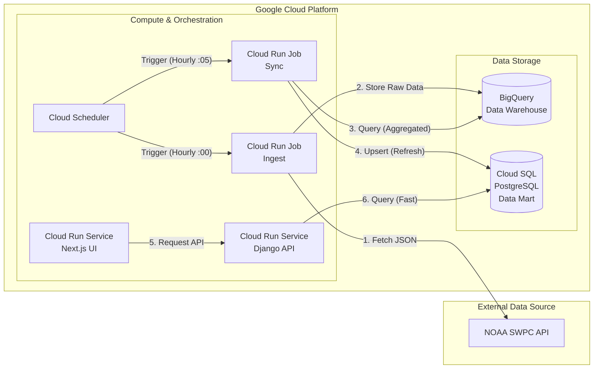

# Celestial Biome

**Celestial Biome** は、コーヒー、ワイン、フライフィッシング、宇宙、アウトドアといった要素を統合するプラットフォームプロジェクトです。

Google Cloud Platform (GCP) 上に構築され、最新の技術スタックと厳格な運用ルールに基づき開発されています。

## 🏗 Architecture & Tech Stack

[cite_start]本プロジェクトは以下の技術スタックとバージョンを厳守して開発されています。

### Backend (Server Side)

| Component           | Technology            | Version     | Note                     |
| ------------------- | --------------------- | ----------- | ------------------------ |
| **Framework**       | Django                | **5.2 LTS** | App Config / ORM         |
| **API**             | Django REST Framework | Latest      | API Construction         |
| **Schema**          | drf-spectacular       | Latest      | OpenAPI/Swagger Auto-gen |
| **Language**        | Python                | **3.12**    |                          |
| **Pkg Manager**     | **uv**                | Latest      | **pip/poetry 使用禁止**  |
| **Lint/Fmt**        | Ruff                  | Latest      | Enforced by pre-commit   |
| **Testing**         | pytest                | Latest      |                          |
| **Monitoring**      | Sentry                | Latest      | Python SDK               |
| **Async**           | **Cloud Tasks**       | -           | No Celery/Redis          |
| **Data Analysis**　 | **Pandas**            | Latest      | Data manipulation        |

### Frontend (Client Side)

| Component         | Technology         | Version     | Note                         |
| ----------------- | ------------------ | ----------- | ---------------------------- |
| **Framework**     | Next.js            | **16**      | App Router                   |
| **Language**      | TypeScript         | 5.x         |                              |
| **Runtime**       | Node.js            | **v22 LTS** |                              |
| **Styling**       | Tailwind CSS       | **v4**      |                              |
| **Lint/Fmt**      | **Biome**          | Latest      | **ESLint/Prettier 使用禁止** |
| **Type Gen**      | openapi-typescript | Latest      | Schema Driven Dev            |
| **Testing**       | Vitest             | Latest      |                              |
| **Visualization** | Recharts           | Latest      | Charts & Graphs              |

### Infrastructure

| Component          | Technology          | Note                                     |
| ------------------ | ------------------- | ---------------------------------------- |
| **Cloud**          | Google Cloud (GCP)  |                                          |
| **Compute**        | Cloud Run           | Frontend & Backend (Standalone)          |
| **ETL / Batch**    | Cloud Run Jobs      | Scheduled by Cloud Scheduler             |
| **Database**       | Cloud SQL           | PostgreSQL 16 (**App Data & Data Mart**) |
| **Data Warehouse** | BigQuery            | **Time-series data storage**             |
| **Storage**        | Cloud Storage (GCS) | Static & Media files                     |
| **IaC**            | Terraform           | Infrastructure management                |
| **CI/CD**          | GitHub Actions      | CI, Build, Deploy                        |

---

## 📂 Project Structure

```text
celestial_biome
├── .github/workflows       # CI/CD (ci.yml, deploy.yml)
├── .pre-commit-config.yaml # Code Quality Rules (Ruff & Biome)
├── compose.yaml            # Local Development (Hot Reload)
├── src
│   ├── backend             # Django Root
│   │   ├── config          # Settings, URLs
│   │   ├── pyproject.toml  # Managed by uv
│   │   └── Dockerfile      # Prod: uv base
│   └── frontend            # Next.js Root
│       ├── app             # App Router
│       ├── biome.json      # Biome Config
│       └── Dockerfile      # Prod: Node 22 Multi-stage
└── terraform               # Infrastructure definitions
```

## 💻 Local Development

### Prerequisites:

- Docker & Docker Compose

- uv (Python Package Manager)

- Node.js v22+ & npm

1. Setup Backend
   Backend の依存関係は `uv` で管理されています。

```text
cd src/backend
uv sync
```

2. Setup Frontend
   Frontend の依存関係をインストールします。

```text
cd src/frontend
npm install
```

3. Start Application
   Docker Compose を使用して開発環境（Hot Reload 有効）を起動します。

```text
# プロジェクトルートで実行

docker compose up --build
```

- Frontend: http://localhost:3000

- Backend API: http://localhost:8000

- Admin Panel: http://localhost:8000/admin/

## ⚙️ Operational Rules & Workflows

### 1. Schema Driven Development

Backend と Frontend の型同期は、OpenAPI スキーマを介して行います。

1.  Backend: モデルや API に変更を加える。
2.  Backend: `drf-spectacular` 経由で `schema.yml` (OpenAPI) を生成する。
3.  Frontend: `openapi-typescript` を実行し、Backend の型定義を TypeScript 型として自動生成・取り込みを行う。

### 2. Code Quality (Pre-commit)

コミット時に `pre-commit` フックが作動し、コード品質を強制します。

- Backend: `Ruff` による Lint と Format 修正。

- Frontend: `Biome` による Lint と Format 修正。

手動実行する場合：

```text
# Backend (src/backend)

uv run ruff check --fix .
uv run ruff format .

# Frontend (src/frontend)

npx biome check --write .
```

### 3. Async Operations

非同期処理が必要な場合は、Celery/Redis 構成ではなく、**Google Cloud Tasks** を使用してください。

### 4. Data Pipeline (Space Weather)

宇宙天気データ（NOAA SWPC）を収集・蓄積し、可視化するパイプラインを構築しています。
**Data Warehouse (BigQuery)** と **Data Mart (Cloud SQL)** を分離することで、分析用データの蓄積と Web アプリの高速応答を両立させています。



1.  **Ingestion (ETL)**: Cloud Run Job (`ingest_space_weather`) が NOAA からデータを取得し、**BigQuery** に蓄積 (毎時 0 分実行)。
2.  **Sync (Data Mart)**: Cloud Run Job (`sync_bq_to_db`) が BigQuery から直近 7 日分のデータを集計・取得し、**Cloud SQL** の専用テーブルに洗い替え (毎時 5 分実行)。
3.  **Serving**: Backend API は **Cloud SQL** を参照してデータを返却。これにより、BigQuery の起動オーバーヘッドを回避し、高速なレスポンスを実現。
4.  **Visualization**: Frontend (Next.js + Recharts) でデータを可視化。

### Management Commands

- **Ingest Space Weather Data**
  NOAA から宇宙天気データを手動で取得・保存します。

  ```bash
  # ローカル実行 (.env に GCP_PROJECT_ID が必要)
  uv run python manage.py ingest_space_weather --days 7
  ```

- Sync Data Mart (BigQuery -> Cloud SQL)
  BigQuery から直近 7 日間のデータを取得し、Cloud SQL (Data Mart) を更新します。
  ```bash
  uv run python manage.py sync_bq_to_db
  ```

## 🚀 Deployment & Operations

### Deployment

GitHub Actions により、`main` ブランチへのプッシュで自動的に Build と Cloud Run への Deploy が行われます。

### Database Migration (Production)

本番環境 (Cloud SQL) へのマイグレーションは、Cloud Run Jobs を使用して安全に実行します。

```text
# 実行例 (変数は環境に合わせて設定)

gcloud run jobs deploy migrate-db \
 --image $IMAGE \
  --region $REGION \
  --set-cloudsql-instances $INSTANCE_CONNECTION_NAME \
  --set-env-vars DB_NAME=celestial_db \
  --set-env-vars DB_USER=celestial_user \
  --set-env-vars GCP_PROJECT_ID=$PROJECT_ID \
 --command "python,manage.py,migrate" \
 --execute-now
```

### Superuser Creation

管理ユーザーの作成も同様に Cloud Run Jobs 経由で行います。

```text
gcloud run jobs deploy create-superuser \
 --image $IMAGE \
 --command "python,manage.py,createsuperuser,--noinput" \
 --execute-now
```
